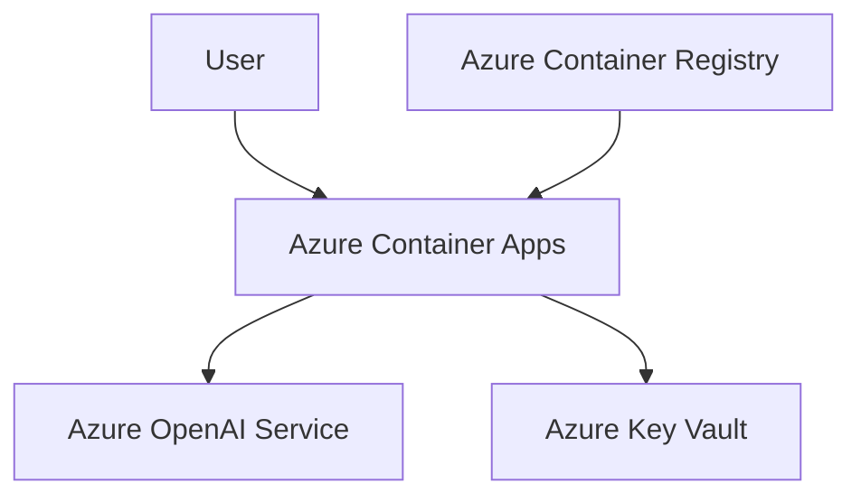

# Azure Services Documentation

This document details the Azure services used in the Content GPT application and potential enhancements.

## Current Azure Services Used

### 1. Azure Container Apps
- **Purpose**: Hosting the application
- **Configuration**:
  - Location: East US
  - Resource Group: content-gpt-rg
  - Managed Environment: content-gpt-env
  - Container Configuration:
    - Image: contentgpt.azurecr.io/content-gpt:latest
    - Resources: 0.5 CPU, 1GB Memory
    - Scale: 1-10 replicas
    - Ingress: External, HTTP, Port 80

### 2. Azure Container Registry (ACR)
- **Purpose**: Storing Docker images
- **Configuration**:
  - Registry Name: contentgpt
  - Authentication: Managed Identity
  - Image: content-gpt:latest

### 3. Azure Key Vault
- **Purpose**: Secure storage of sensitive data
- **Configuration**:
  - Vault Name: content-gpt-kv
  - Secrets Stored:
    - azure-openai-endpoint
    - azure-openai-key
    - azure-openai-deployment
  - Access Control: RBAC with Container App managed identity

### 4. Azure OpenAI Service
- **Purpose**: Content generation
- **Configuration**:
  - Model: GPT-4
  - Deployment: gpt-4o-mini
  - Endpoint: Custom endpoint for secure access

## Current Architecture



## Potential Enhancements

### 1. Security Improvements
- **Azure Front Door**
  - Add DDoS protection
  - Implement WAF (Web Application Firewall)
  - Custom domain with SSL
  - Geographic routing

- **Azure Private Link**
  - Secure private connectivity between services
  - Isolate services from public internet
  - Reduce exposure to potential threats

- **Azure Defender for Cloud**
  - Advanced threat protection
  - Security posture management
  - Vulnerability assessment

### 2. Monitoring and Observability
- **Azure Monitor**
  - Application Insights integration
  - Custom metrics and alerts
  - Performance monitoring
  - User behavior analytics

- **Azure Log Analytics**
  - Centralized logging
  - Advanced querying
  - Log retention policies
  - Custom dashboards

- **Azure Application Gateway**
  - SSL termination
  - URL-based routing
  - Session affinity
  - Web application firewall

### 3. Scalability and Performance
- **Azure Cache for Redis**
  - Caching frequently accessed data
  - Session management
  - Rate limiting
  - Performance optimization

- **Azure CDN**
  - Global content delivery
  - Static content caching
  - Reduced latency
  - Bandwidth optimization

- **Azure Traffic Manager**
  - Geographic load balancing
  - Failover capabilities
  - Performance-based routing
  - Multi-region deployment

### 4. DevOps and CI/CD
- **Azure DevOps**
  - Automated builds
  - Release pipelines
  - Test automation
  - Environment management

- **GitHub Actions**
  - Automated deployments
  - Security scanning
  - Dependency updates
  - Code quality checks

### 5. Data and Storage
- **Azure Blob Storage**
  - File uploads
  - Content storage
  - Backup solutions
  - Static website hosting

- **Azure Cosmos DB**
  - User data storage
  - Session management
  - Analytics data
  - Global distribution

### 6. AI and Machine Learning
- **Azure Cognitive Services**
  - Text analytics
  - Content moderation
  - Language detection
  - Sentiment analysis

- **Azure Machine Learning**
  - Custom model training
  - A/B testing
  - Performance optimization
  - User behavior prediction

## Implementation Roadmap

### Phase 1: Security and Monitoring
1. Implement Azure Front Door
2. Set up Azure Monitor and Application Insights
3. Configure Azure Defender for Cloud
4. Enable Azure Private Link

### Phase 2: Performance and Scalability
1. Deploy Azure Cache for Redis
2. Configure Azure CDN
3. Set up Azure Traffic Manager
4. Implement multi-region deployment

### Phase 3: Advanced Features
1. Integrate Azure Cognitive Services
2. Set up Azure Blob Storage
3. Configure Azure Cosmos DB
4. Implement Azure Machine Learning

## Cost Optimization

### Current Costs
- Azure Container Apps: Pay-per-use
- Azure Container Registry: Basic tier
- Azure Key Vault: Standard tier
- Azure OpenAI: Pay-per-use

### Cost Optimization Strategies
1. **Reserved Instances**
   - Purchase reserved capacity for predictable workloads
   - Up to 72% cost savings

2. **Auto-scaling**
   - Implement smart scaling rules
   - Scale down during off-peak hours
   - Use predictive scaling

3. **Resource Optimization**
   - Right-size container resources
   - Implement caching
   - Use spot instances for non-critical workloads

4. **Monitoring and Alerts**
   - Set up cost alerts
   - Monitor resource utilization
   - Implement budget controls

## Best Practices

1. **Security**
   - Use managed identities
   - Implement least privilege access
   - Enable encryption at rest
   - Regular security audits

2. **Performance**
   - Implement caching
   - Use CDN for static content
   - Optimize container size
   - Monitor and adjust resources

3. **Reliability**
   - Implement health checks
   - Set up auto-recovery
   - Use multiple regions
   - Regular backups

4. **Maintenance**
   - Regular updates
   - Security patches
   - Performance monitoring
   - Cost optimization

## Troubleshooting Guide

### Common Issues and Solutions

1. **Container App Issues**
   ```bash
   # Check container logs
   az containerapp logs show --name content-gpt-app --resource-group content-gpt-rg

   # Check container status
   az containerapp show --name content-gpt-app --resource-group content-gpt-rg --query "properties.runningStatus"
   ```

2. **Key Vault Access Issues**
   ```bash
   # Verify Key Vault access
   az keyvault secret list --vault-name content-gpt-kv

   # Check role assignments
   az role assignment list --assignee <principal-id> --scope /subscriptions/<subscription-id>/resourceGroups/content-gpt-rg/providers/Microsoft.KeyVault/vaults/content-gpt-kv
   ```

3. **Container Registry Issues**
   ```bash
   # Check ACR login
   az acr login --name contentgpt

   # List images
   az acr repository list --name contentgpt
   ```

4. **Network Issues**
   ```bash
   # Check network configuration
   az containerapp ingress show --name content-gpt-app --resource-group content-gpt-rg

   # Test connectivity
   az containerapp exec --name content-gpt-app --resource-group content-gpt-rg --command "curl -v https://your-endpoint"
   ```

## Support and Resources

- [Azure Container Apps Documentation](https://docs.microsoft.com/en-us/azure/container-apps/)
- [Azure Key Vault Documentation](https://docs.microsoft.com/en-us/azure/key-vault/)
- [Azure OpenAI Documentation](https://docs.microsoft.com/en-us/azure/cognitive-services/openai/)
- [Azure Architecture Center](https://docs.microsoft.com/en-us/azure/architecture/)
- [Azure Pricing Calculator](https://azure.microsoft.com/en-us/pricing/calculator/) 